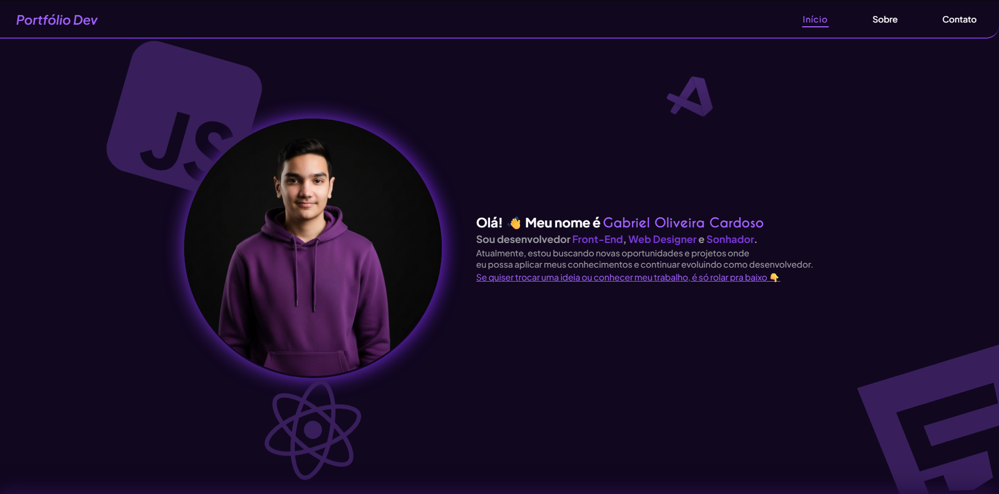

# Portfólio - Gabriel Oliveira Cardoso


<p align="center">
  
</p>

## 📓 Descrição

Portfólio desenvolvido para apresentar meus projetos e habilidades como desenvolvedor. O objetivo foi criar um espaço moderno, responsivo e intuitivo, que refletisse minha identidade profissional e minha forma de trabalhar. Além de reunir alguns dos meus trabalhos, o projeto destaca meu cuidado com o design, a performance e a experiência do usuário em diferentes dispositivos.

## 🖥️ Tecnologias
- HTML5
- CSS3
- JavaScript
- Git e Github

## 📁 Estrutura de pastas
```bash
  portfolio/
  ├── assets/     # Pasta com as imagens
  ├── favicon/    # Pasta com o favicon
  ├── fonts/      # Pasta com as fontes
  ├── js/         # Pasta com os arquivos JavaScript
  ├── pages       # Pasta com todas as páginas do projeto
  ├── styles/     # Pasta com todos os estilos
  ├── index.css   # Arquivo que importa todos os estilos
  ├── index.html  # Arquivo principal
  └── README.md
```

## 📝 Licença

Este projeto está sob a [licença MIT License](./LICENSE).